# Phase 3 Execution Plan: MVP vs Full Implementation

**Before**: Linear pipeline with static, human-edited context
```
Domain → Company Research → Account Profile → Persona → Email
         (human edits)      (human edits)   (human edits)
```

**After**: Dynamic context with multiple update pathways
```
Context Store ←── Performance Data (emails working/not working)
     ↕           ←── Meeting Notes (founder updates ICP hypothesis) 
Agent Suggestions ←── Cross-Client Patterns (subject lines for fintech)
     ↕           ←── Real-World Analysis (CRM data insights)
Human Approval ──→ Context Updates ──→ Improved Agent Performance
```

## Current State Analysis

### What We Have (✅)
- Basic 5-step GTM generation pipeline
- JSON file storage system
- Pydantic schema validation
- TensorBlock Forge LLM integration
- Template-based prompt rendering

### What We're Missing (❌)
- Dynamic agent orchestration
- Knowledge graph and learning systems
- Client-specific customization
- Performance feedback loops
- Multi-source intelligence gathering
- Advanced debugging and monitoring

## Dynamic Context Management Architecture

```mermaid
graph TB
    %% Central Context Store
    ContextStore[(🧠 Dynamic Context Store<br/>• Client-specific context<br/>• Cross-client patterns<br/>• Performance insights<br/>• Real-time updates)]
    
    %% 5 Context Update Pathways
    
    %% 1. Analysis Agents Processing Real-World Data
    CRMData[📊 CRM Analysis Agent<br/>• Process contact data<br/>• Identify buying signals<br/>• Update ICP profiles] --> ContextStore
    
    EmailAnalysis[📧 Email Performance Agent<br/>• Analyze open/click rates<br/>• Identify winning patterns<br/>• Suggest prompt updates] --> ContextStore
    
    LinkedInAnalysis[💼 LinkedIn Performance Agent<br/>• Track acceptance rates<br/>• Analyze message performance<br/>• Update outreach strategies] --> ContextStore
    
    %% 2. Direct Human Uploads
    HumanInput[👤 Human Input Channel<br/>• Meeting notes upload<br/>• Strategy documents<br/>• ICP hypothesis updates<br/>• Manual context edits] --> ContextStore
    
    %% 3. Agent Suggestions (Human Approval Required)
    AgentSuggestions[🤖 Agent Suggestions<br/>• Performance-based optimizations<br/>• Pattern-based improvements<br/>• Cross-client insights<br/>• ⚠️ Requires human approval] --> ApprovalQueue{🔍 Human Review<br/>Approve/Reject/Modify}
    
    ApprovalQueue -->|Approved| ContextStore
    ApprovalQueue -->|Rejected| Feedback[📝 Feedback Loop]
    
    %% 4. Cross-Client Pattern Learning
    PatternEngine[🔄 Pattern Learning Engine<br/>• Anonymized cross-client data<br/>• Industry-specific insights<br/>• Best practice extraction<br/>• Success pattern identification] --> AgentSuggestions
    
    %% 5. Self-Updating Best Practices
    BestPractices[📚 Best Practices Engine<br/>• Email subject line patterns<br/>• Messaging frameworks<br/>• Industry-specific approaches<br/>• Timing optimizations] --> ContextStore
    
    %% Core Agents (Context-Aware)
    ContextStore --> Company[🏢 Company Research Agent<br/>• Uses industry patterns<br/>• Applies client context<br/>• Updates company profiles]
    
    ContextStore --> Account[🎯 Account Intelligence Agent<br/>• Leverages CRM insights<br/>• Applies ICP patterns<br/>• Scores leads dynamically]
    
    ContextStore --> Persona[👤 Persona Builder Agent<br/>• Uses behavioral patterns<br/>• Applies social signals<br/>• Creates targeted personas]
    
    ContextStore --> Email[✉️ Email Strategist Agent<br/>• Uses performance data<br/>• Applies proven patterns<br/>• Generates optimized content]
    
    ContextStore --> LinkedIn[💼 LinkedIn Outreach Agent<br/>• Uses engagement data<br/>• Applies connection strategies<br/>• Personalizes messages]
    
    %% Data Sources Feed Analysis
    CRMSources[🔗 CRM Data Sources<br/>• HubSpot<br/>• Apollo<br/>• Contact updates] --> CRMData
    
    EmailPlatforms[📬 Email Platforms<br/>• Outreach.io<br/>• Reply.io<br/>• Performance metrics] --> EmailAnalysis
    
    LinkedInTools[🔗 LinkedIn Tools<br/>• Phantombuster<br/>• Sales Navigator<br/>• Engagement metrics] --> LinkedInAnalysis
    
    %% Cross-Client Learning (Privacy-Preserving)
    Company --> PatternEngine
    Account --> PatternEngine
    Persona --> PatternEngine
    Email --> PatternEngine
    LinkedIn --> PatternEngine
    
    %% Feedback Loops
    Feedback --> PatternEngine
    
    classDef context fill:#fff3e0,stroke:#ef6c00,stroke-width:3px
    classDef analysis fill:#e8f5e8,stroke:#2e7d32,stroke-width:2px
    classDef human fill:#e1f5fe,stroke:#0277bd,stroke-width:2px
    classDef agents fill:#f3e5f5,stroke:#7b1fa2,stroke-width:2px
    classDef learning fill:#fce4ec,stroke:#c2185b,stroke-width:2px
    
    class ContextStore context
    class CRMData,EmailAnalysis,LinkedInAnalysis analysis
    class HumanInput,ApprovalQueue human
    class Company,Account,Persona,Email,LinkedIn agents
    class PatternEngine,BestPractices,AgentSuggestions learning
```



## Detailed Component Design

## The 5 Context Update Pathways

### 1. Analysis Agents Processing Real-World Data

**Goal**: Agents automatically analyze CRM, email, and LinkedIn data to update context.

**Current Code to Add**:
- New `cli/services/analysis_agents/` module
- Automated data processing and context updates

**New Implementation**:
```python
class CRMAnalysisAgent:
    """Analyzes CRM data to identify patterns and update ICP context"""
    
    async def analyze_contact_patterns(self, client_id: str) -> ContextUpdate:
        # Get recent CRM contacts
        contacts = await self.crm_connector.get_recent_contacts(client_id, days=30)
        
        # Analyze patterns in successful vs unsuccessful contacts
        successful_contacts = [c for c in contacts if c.converted]
        failed_contacts = [c for c in contacts if c.was_rejected]
        
        # Extract patterns
        success_patterns = self.extract_patterns(successful_contacts)
        failure_patterns = self.extract_patterns(failed_contacts)
        
        # Generate context updates
        suggested_updates = {
            'icp_refinements': self.generate_icp_updates(success_patterns),
            'personas_to_avoid': self.generate_avoid_patterns(failure_patterns),
            'messaging_insights': self.analyze_messaging_effectiveness(contacts),
            'confidence': self.calculate_confidence(len(contacts))
        }
        
        return ContextUpdate(
            source='crm_analysis',
            client_id=client_id,
            updates=suggested_updates,
            requires_approval=True,
            evidence=self.compile_evidence(contacts)
        )

class EmailPerformanceAgent:
    """Analyzes email performance to optimize messaging"""
    
    async def analyze_email_performance(self, client_id: str) -> ContextUpdate:
        # Get recent email campaigns
        campaigns = await self.email_platform.get_campaigns(client_id, days=14)
        
        # Analyze what's working
        high_performers = [c for c in campaigns if c.reply_rate > 0.05]
        low_performers = [c for c in campaigns if c.reply_rate < 0.01]
        
        # Extract winning patterns
        winning_subjects = self.analyze_subject_patterns(high_performers)
        winning_messages = self.analyze_message_patterns(high_performers)
        
        suggested_updates = {
            'email_prompts': {
                'subject_optimization': winning_subjects,
                'message_optimization': winning_messages,
                'avoid_patterns': self.analyze_failure_patterns(low_performers)
            },
            'timing_insights': self.analyze_send_times(campaigns),
            'confidence': self.calculate_statistical_significance(campaigns)
        }
        
        return ContextUpdate(
            source='email_performance',
            client_id=client_id,
            updates=suggested_updates,
            requires_approval=True,
            evidence=self.compile_performance_evidence(campaigns)
        )
```

### 2. Direct Human Uploads (Google Docs/Notion/Coda Integration)

**Goal**: Weekly snapshot processing from collaborative tools like Google Docs, Notion, and Coda.

**Current Code to Add**:
- New `cli/services/document_processing/` module
- Weekly snapshot upload and change detection

**New Implementation**:
```python
class DocumentSnapshotProcessor:
    """Processes weekly snapshots from collaborative tools"""
    
    async def process_weekly_snapshot(self, client_id: str, documents: List[DocumentSnapshot]):
        """Process a batch of documents uploaded weekly"""
        
        context_updates = []
        
        for doc in documents:
            # Detect document type and extract relevant insights
            doc_type = self.classify_document(doc.content, doc.title)
            
            if doc_type == 'meeting_notes':
                updates = await self.extract_meeting_insights(doc, client_id)
            elif doc_type == 'strategy_document':
                updates = await self.extract_strategy_changes(doc, client_id)
            elif doc_type == 'icp_hypothesis':
                updates = await self.extract_icp_updates(doc, client_id)
            else:
                updates = await self.extract_general_insights(doc, client_id)
            
            if updates:
                context_updates.append(updates)
        
        # Batch process all updates
        return await self.apply_batch_updates(client_id, context_updates)

    def classify_document(self, content: str, title: str) -> str:
        """Auto-classify document type using LLM"""
        classification_prompt = f"""
        Classify this document based on title and content:
        
        Title: {title}
        Content preview: {content[:500]}...
        
        Categories:
        - meeting_notes: Client meeting notes, strategy sessions, feedback
        - strategy_document: GTM strategy, positioning, messaging frameworks
        - icp_hypothesis: Target customer analysis, persona updates, market insights
        - performance_review: Campaign results, email/LinkedIn analytics
        - other: General documents
        
        Return only the category name.
        """
        return self.llm_client.classify(classification_prompt)

class ChangeDetectionEngine:
    """Detects meaningful changes between document snapshots"""
    
    async def detect_changes(self, client_id: str, new_docs: List[DocumentSnapshot]):
        """Compare new snapshots with previous versions to find changes"""
        
        changes = []
        
        for doc in new_docs:
            # Get last snapshot of this document type
            last_snapshot = await self.get_last_snapshot(client_id, doc.title)
            
            if not last_snapshot:
                # First time seeing this document
                changes.append(await self.extract_full_insights(doc))
            else:
                # Compare with previous version
                semantic_changes = await self.detect_semantic_changes(
                    old_content=last_snapshot.content,
                    new_content=doc.content
                )
                
                if semantic_changes:
                    changes.append(ContextUpdate(
                        source='document_update',
                        client_id=client_id,
                        updates=semantic_changes,
                        document_title=doc.title,
                        change_summary=semantic_changes.get('summary'),
                        requires_approval=False  # Human-generated content
                    ))
        
        return changes
    
    async def detect_semantic_changes(self, old_content: str, new_content: str) -> dict:
        """Use LLM to detect meaningful changes, not just text diffs"""
        
        change_analysis_prompt = f"""
        Compare these two versions of a strategy document and identify MEANINGFUL changes:
        
        OLD VERSION:
        {old_content}
        
        NEW VERSION:
        {new_content}
        
        Focus on:
        - Changes to target customer definitions (ICP updates)
        - New messaging strategies or positioning
        - Updated goals, priorities, or timelines
        - New insights about what's working/not working
        - Strategy pivots or refinements
        
        Ignore:
        - Minor wording changes
        - Formatting updates
        - Typo corrections
        
        Return JSON with:
        {{
            "has_meaningful_changes": true/false,
            "icp_updates": [...],
            "messaging_changes": [...],
            "strategy_updates": [...],
            "insights": [...],
            "summary": "Brief description of key changes"
        }}
        """
        
        return await self.llm_client.analyze_changes(change_analysis_prompt)

class GoogleDocsSnapshotExporter:
    """Helper for exporting Google Docs as snapshots"""
    
    def export_weekly_snapshots(self, folder_id: str) -> List[DocumentSnapshot]:
        """Export all docs from a shared folder"""
        
        # You'd run this manually or with a simple script
        docs = self.google_drive_api.list_files(folder_id)
        snapshots = []
        
        for doc in docs:
            if doc.modified_time > self.last_export_time:
                content = self.google_docs_api.export_as_text(doc.id)
                snapshots.append(DocumentSnapshot(
                    title=doc.name,
                    content=content,
                    modified_date=doc.modified_time,
                    source='google_docs',
                    url=doc.web_view_link
                ))
        
        return snapshots

class NotionSnapshotExporter:
    """Export Notion pages as snapshots"""
    
    def export_from_database(self, database_id: str) -> List[DocumentSnapshot]:
        """Export pages from a Notion database"""
        
        pages = self.notion_api.query_database(database_id)
        snapshots = []
        
        for page in pages:
            if self.is_recently_modified(page):
                content = self.notion_api.get_page_content(page.id)
                snapshots.append(DocumentSnapshot(
                    title=page.properties['Name']['title'][0]['plain_text'],
                    content=content,
                    modified_date=page.last_edited_time,
                    source='notion',
                    url=page.url
                ))
        
        return snapshots

class DocumentRelationshipTracker:
    """Track relationships between documents and context areas"""
    
    def map_document_to_context(self, doc_title: str, content: str) -> List[str]:
        """Determine which context areas this document affects"""
        
        context_mapping = {
            'icp': ['target customer', 'ideal client', 'customer profile'],
            'messaging': ['value prop', 'positioning', 'messaging', 'pitch'],
            'strategy': ['gtm strategy', 'go-to-market', 'sales strategy'],
            'performance': ['results', 'metrics', 'performance', 'analytics'],
            'competitive': ['competitor', 'competitive', 'market position']
        }
        
        affected_contexts = []
        content_lower = content.lower()
        
        for context_type, keywords in context_mapping.items():
            if any(keyword in content_lower for keyword in keywords):
                affected_contexts.append(context_type)
        
        return affected_contexts
```

**Weekly Workflow Example**:
```bash
# Monday Morning Routine:

# 1. Export from your tools (manual or scripted)
./export-google-docs.sh acme-corp-folder
./export-notion.sh client-strategy-db

# 2. Upload snapshots to Blossomer
blossomer upload-docs --client acme-corp \
  --files ./exports/*.txt \
  --week 2024-01-15

# 3. Review extracted insights
blossomer review-insights --client acme-corp
  📋 Found 3 strategy updates:
    • Updated ICP to focus on Series B+ companies
    • New messaging emphasis on compliance features  
    • LinkedIn outreach timing changed to Tue/Wed
  
  ❓ Apply these updates? [y/N]

# 4. Context automatically updates for the week
blossomer generate email --client acme-corp
  ✨ Using updated context with compliance messaging focus
```

**Recommended Tools**:
- **Google Docs**: Google Drive API for automated exports
- **Notion**: Notion API for database exports
- **Coda**: Coda API for document exports
- **Document Processing**: LLM-based classification and change detection

## How Context Gets Transferred: The New Paradigm

### Before: Linear Context Passing
```
Company Agent → Static JSON → Account Agent → Static JSON → Persona Agent → ...
```

### After: Dynamic Context Orchestration
```
                    ┌─── Context Manager ───┐
                    │                       │
Context Store ──────┼─── Agent Router ─────┼─── Enhanced Agents
    ↑               │                       │         ↓
    │               └───────────────────────┘    Agent Outputs
    │                                                 │
    └─── Context Updates ← Analysis Agents ←──────────┘
```

**Key Transformation**: Context becomes **centralized and dynamic** rather than linear and static.

### Dynamic Context Management Implementation

```python
class DynamicContextManager:
    """Central hub for all context operations"""
    
    def __init__(self):
        self.context_store = ContextStore()
        self.update_queue = ContextUpdateQueue()
        self.version_manager = ContextVersionManager()
    
    async def get_context_for_agent(self, client_id: str, agent_type: str, request_context: dict = None) -> EnrichedContext:
        """Get dynamically enriched context for a specific agent"""
        
        # Start with base client context
        base_context = await self.context_store.get_client_context(client_id)
        
        # Layer on agent-specific context
        agent_context = await self.context_store.get_agent_context(client_id, agent_type)
        
        # Add real-time context from current request
        if request_context:
            merged_context = self.merge_contexts(base_context, agent_context, request_context)
        else:
            merged_context = self.merge_contexts(base_context, agent_context)
        
        # Enrich with latest patterns and insights
        enriched_context = await self.enrich_with_patterns(merged_context, client_id, agent_type)
        
        # Add cross-client insights (if applicable)
        final_context = await self.add_cross_client_insights(enriched_context, client_id, agent_type)
        
        return EnrichedContext(
            base=base_context,
            agent_specific=agent_context,
            enrichments=enriched_context,
            cross_client_insights=final_context,
            version=self.version_manager.get_current_version(client_id),
            timestamp=datetime.now()
        )
    
    async def enrich_with_patterns(self, context: dict, client_id: str, agent_type: str) -> dict:
        """Enrich context with performance patterns and insights"""
        
        enrichments = {}
        
        if agent_type == 'email_agent':
            # Add email performance patterns
            email_patterns = await self.get_email_patterns(client_id)
            enrichments['winning_subject_patterns'] = email_patterns.get('subjects', [])
            enrichments['message_patterns'] = email_patterns.get('messages', [])
            enrichments['timing_insights'] = email_patterns.get('timing', {})
            
        elif agent_type == 'linkedin_agent':
            # Add LinkedIn performance patterns
            linkedin_patterns = await self.get_linkedin_patterns(client_id)
            enrichments['connection_strategies'] = linkedin_patterns.get('connections', [])
            enrichments['engagement_patterns'] = linkedin_patterns.get('engagement', [])
            
        elif agent_type == 'account_agent':
            # Add CRM insights and lead scoring patterns
            crm_insights = await self.get_crm_insights(client_id)
            enrichments['conversion_patterns'] = crm_insights.get('conversions', [])
            enrichments['lead_scoring_updates'] = crm_insights.get('scoring', {})
            
        elif agent_type == 'persona_agent':
            # Add behavioral patterns and social signals
            persona_insights = await self.get_persona_insights(client_id)
            enrichments['behavioral_patterns'] = persona_insights.get('behaviors', [])
            enrichments['social_signals'] = persona_insights.get('social', [])
        
        return {**context, 'performance_enrichments': enrichments}

class ContextStore:
    """Centralized storage for all context data"""
    
    def __init__(self):
        self.db = PostgreSQLConnection()
        self.cache = RedisCache()
    
    async def get_client_context(self, client_id: str) -> dict:
        """Get base client context with caching"""
        
        cache_key = f"client_context:{client_id}"
        cached = await self.cache.get(cache_key)
        
        if cached:
            return cached
        
        # Load from database
        context = await self.db.query("""
            SELECT 
                config,
                industry,
                company_size,
                messaging_preferences,
                icp_definition,
                last_updated
            FROM clients 
            WHERE id = %s
        """, client_id)
        
        # Load recent context updates
        recent_updates = await self.db.query("""
            SELECT updates, source, created_at
            FROM context_updates 
            WHERE client_id = %s 
            AND status = 'approved'
            AND created_at > NOW() - INTERVAL '30 days'
            ORDER BY created_at DESC
        """, client_id)
        
        # Merge updates into base context
        enriched_context = self.apply_updates(context, recent_updates)
        
        # Cache for 1 hour
        await self.cache.set(cache_key, enriched_context, ttl=3600)
        
        return enriched_context
    
    async def apply_context_update(self, update: ContextUpdate):
        """Apply a context update to the store"""
        
        # Store the update
        await self.db.execute("""
            INSERT INTO context_updates (
                client_id, source, updates, requires_approval, 
                confidence, evidence, created_at
            ) VALUES (%s, %s, %s, %s, %s, %s, %s)
        """, 
        update.client_id, update.source, update.updates, 
        update.requires_approval, update.confidence, 
        update.evidence, update.timestamp)
        
        # Invalidate cache
        cache_key = f"client_context:{update.client_id}"
        await self.cache.delete(cache_key)
        
        # If auto-approved, immediately apply to client config
        if not update.requires_approval:
            await self.merge_into_client_config(update.client_id, update.updates)

class AgentContextRouter:
    """Routes context to agents based on their specific needs"""
    
    def __init__(self):
        self.context_manager = DynamicContextManager()
        self.agent_registry = AgentRegistry()
    
    async def route_context_to_agent(self, agent_type: str, client_id: str, task_context: dict = None) -> dict:
        """Get context specifically formatted for an agent's needs"""
        
        # Get enriched context
        context = await self.context_manager.get_context_for_agent(client_id, agent_type, task_context)
        
        # Format context for specific agent
        if agent_type == 'company_research':
            return self.format_for_company_agent(context)
        elif agent_type == 'account_intelligence':
            return self.format_for_account_agent(context)
        elif agent_type == 'persona_builder':
            return self.format_for_persona_agent(context)
        elif agent_type == 'email_strategist':
            return self.format_for_email_agent(context)
        elif agent_type == 'linkedin_outreach':
            return self.format_for_linkedin_agent(context)
        else:
            return context.base
    
    def format_for_email_agent(self, context: EnrichedContext) -> dict:
        """Format context specifically for email generation"""
        
        return {
            # Static context
            'company_profile': context.base.get('company_profile', {}),
            'account_profile': context.base.get('account_profile', {}),
            'persona_profile': context.base.get('persona_profile', {}),
            
            # Performance-driven enhancements
            'winning_subject_patterns': context.enrichments.get('winning_subject_patterns', []),
            'message_patterns': context.enrichments.get('message_patterns', []),
            'timing_insights': context.enrichments.get('timing_insights', {}),
            
            # Cross-client insights
            'industry_email_patterns': context.cross_client_insights.get('email_patterns', []),
            'proven_frameworks': context.cross_client_insights.get('frameworks', []),
            
            # Real-time context
            'current_campaign_goals': context.agent_specific.get('campaign_goals', {}),
            'avoid_patterns': context.enrichments.get('avoid_patterns', []),
            
            # Metadata
            'context_version': context.version,
            'last_updated': context.timestamp
        }
    
    def format_for_linkedin_agent(self, context: EnrichedContext) -> dict:
        """Format context specifically for LinkedIn outreach"""
        
        return {
            # Static context
            'company_profile': context.base.get('company_profile', {}),
            'persona_profile': context.base.get('persona_profile', {}),
            
            # Performance-driven enhancements
            'connection_strategies': context.enrichments.get('connection_strategies', []),
            'engagement_patterns': context.enrichments.get('engagement_patterns', []),
            'acceptance_rate_insights': context.enrichments.get('acceptance_insights', {}),
            
            # Cross-client insights
            'industry_linkedin_patterns': context.cross_client_insights.get('linkedin_patterns', []),
            'role_specific_messaging': context.cross_client_insights.get('role_messaging', {}),
            
            # Real-time context
            'current_outreach_goals': context.agent_specific.get('outreach_goals', {}),
            'message_personalization_level': context.agent_specific.get('personalization', 'medium'),
            
            # Metadata
            'context_version': context.version,
            'last_updated': context.timestamp
        }
```

### Context Flow Diagram - Enhanced Version

```mermaid
graph TB
    %% External Data Sources
    subgraph "Data Sources"
        CRMSources[🗄️ CRM Systems<br/>Real-time contact data]
        EmailMetrics[📧 Email Platforms<br/>Performance metrics]
        LinkedInMetrics[💼 LinkedIn Tools<br/>Engagement data]
        DocSnapshots[📄 Document Snapshots<br/>Weekly strategy updates]
    end
    
    %% Analysis Layer
    subgraph "Analysis Agents"
        CRMAnalysis[📊 CRM Analysis<br/>• Success patterns<br/>• Lead scoring updates]
        EmailAnalysis[📈 Email Analysis<br/>• Subject performance<br/>• Message optimization]
        LinkedInAnalysis[📱 LinkedIn Analysis<br/>• Acceptance patterns<br/>• Message effectiveness]
        DocProcessor[📝 Document Processor<br/>• Strategy changes<br/>• ICP updates]
    end
    
    %% Context Management Layer
    subgraph "Dynamic Context Management"
        ContextStore[(🧠 Context Store<br/>• Client base context<br/>• Performance patterns<br/>• Cross-client insights<br/>• Update history)]
        
        ContextManager[⚡ Context Manager<br/>• Merge contexts<br/>• Apply updates<br/>• Version control]
        
        ContextRouter[🎯 Context Router<br/>• Agent-specific formatting<br/>• Real-time enrichment<br/>• Performance integration]
    end
    
    %% Core Agents (Enhanced)
    subgraph "Context-Aware Agents"
        CompanyAgent[🏢 Company Research<br/>+ Industry patterns<br/>+ Competitive insights]
        
        AccountAgent[🎯 Account Intelligence<br/>+ CRM success patterns<br/>+ Lead scoring data]
        
        PersonaAgent[👤 Persona Builder<br/>+ Behavioral patterns<br/>+ Social signals]
        
        EmailAgent[✉️ Email Strategist<br/>+ Performance patterns<br/>+ Subject optimization<br/>+ Timing insights]
        
        LinkedInAgent[💼 LinkedIn Outreach<br/>+ Acceptance strategies<br/>+ Message templates<br/>+ Engagement patterns]
    end
    
    %% Output Layer (Enhanced)
    subgraph "Enhanced Outputs"
        EnhancedCompany[📋 Enhanced Company Profile<br/>• Basic research<br/>• + Industry benchmarks<br/>• + Competitive positioning]
        
        EnhancedAccount[🎯 Enhanced Account Profile<br/>• ICP definition<br/>• + Success patterns<br/>• + Lead scoring]
        
        EnhancedPersona[👤 Enhanced Persona Profile<br/>• Demographics<br/>• + Behavioral insights<br/>• + Social signals]
        
        OptimizedEmail[✉️ Optimized Email Campaign<br/>• Content<br/>• + Performance patterns<br/>• + A/B test insights]
        
        OptimizedLinkedIn[💼 Optimized LinkedIn Campaign<br/>• Messages<br/>• + Acceptance strategies<br/>• + Timing optimization]
    end
    
    %% Data Flow
    CRMSources --> CRMAnalysis
    EmailMetrics --> EmailAnalysis
    LinkedInMetrics --> LinkedInAnalysis
    DocSnapshots --> DocProcessor
    
    CRMAnalysis --> ContextStore
    EmailAnalysis --> ContextStore
    LinkedInAnalysis --> ContextStore
    DocProcessor --> ContextStore
    
    ContextStore --> ContextManager
    ContextManager --> ContextRouter
    
    ContextRouter -->|Company Context| CompanyAgent
    ContextRouter -->|Account Context + CRM Insights| AccountAgent
    ContextRouter -->|Persona Context + Behavioral Data| PersonaAgent
    ContextRouter -->|Email Context + Performance Data| EmailAgent
    ContextRouter -->|LinkedIn Context + Engagement Data| LinkedInAgent
    
    CompanyAgent --> EnhancedCompany
    AccountAgent --> EnhancedAccount
    PersonaAgent --> EnhancedPersona
    EmailAgent --> OptimizedEmail
    LinkedInAgent --> OptimizedLinkedIn
    
    %% Feedback Loops
    EnhancedCompany -.->|Usage Patterns| ContextStore
    EnhancedAccount -.->|Success Data| ContextStore
    EnhancedPersona -.->|Behavioral Data| ContextStore
    OptimizedEmail -.->|Performance Data| ContextStore
    OptimizedLinkedIn -.->|Engagement Data| ContextStore
    
    classDef data fill:#f1f8e9,stroke:#558b2f,stroke-width:2px
    classDef analysis fill:#e8f5e8,stroke:#2e7d32,stroke-width:2px
    classDef context fill:#fff3e0,stroke:#ef6c00,stroke-width:3px
    classDef agents fill:#e1f5fe,stroke:#0277bd,stroke-width:2px
    classDef output fill:#fce4ec,stroke:#c2185b,stroke-width:2px
    
    class CRMSources,EmailMetrics,LinkedInMetrics,DocSnapshots data
    class CRMAnalysis,EmailAnalysis,LinkedInAnalysis,DocProcessor analysis
    class ContextStore,ContextManager,ContextRouter context
    class CompanyAgent,AccountAgent,PersonaAgent,EmailAgent,LinkedInAgent agents
    class EnhancedCompany,EnhancedAccount,EnhancedPersona,OptimizedEmail,OptimizedLinkedIn output
```



### Key Benefits of New Context Transfer:

1. **Agents get ENRICHED context**, not just previous outputs
2. **Performance data flows back** to improve future context
3. **Cross-client patterns** inform individual decisions
4. **Real-time updates** from CRM, email, and LinkedIn platforms
5. **Human insights** from documents automatically integrated
6. **Version control** allows rollbacks and A/B testing
7. **Agent-specific formatting** optimizes context for each use case

This transforms context from a **static handoff** to a **living intelligence layer** that continuously improves with each interaction.

### 3. Agent Suggestions with Human-in-the-Loop Approval

**Goal**: Agents suggest improvements based on performance, but require human approval.

**New Implementation**:
```python
class ApprovalQueue:
    """Manages agent suggestions requiring human approval"""
    
    async def submit_suggestion(self, suggestion: ContextUpdate) -> str:
        # Store suggestion in approval queue
        suggestion_id = await self.db.store_suggestion(suggestion)
        
        # Notify human reviewers
        await self.notification_service.notify_pending_approval(
            suggestion_id=suggestion_id,
            client_id=suggestion.client_id,
            summary=suggestion.get_summary(),
            evidence=suggestion.evidence
        )
        
        return suggestion_id
    
    async def process_approval(self, suggestion_id: str, decision: str, reviewer: str, notes: str = None):
        suggestion = await self.db.get_suggestion(suggestion_id)
        
        if decision == 'approved':
            # Apply the context update
            await self.context_manager.apply_update(suggestion)
            
            # Log approval for learning
            await self.feedback_logger.log_approval(suggestion_id, reviewer, notes)
            
        elif decision == 'rejected':
            # Log rejection with reasoning for agent learning
            await self.feedback_logger.log_rejection(suggestion_id, reviewer, notes)
            
        elif decision == 'modified':
            # Human modified the suggestion - learn from the changes
            modified_suggestion = await self.get_modified_suggestion(suggestion_id)
            await self.context_manager.apply_update(modified_suggestion)
            await self.feedback_logger.log_modification(suggestion_id, suggestion, modified_suggestion, reviewer)
        
        # Update suggestion status
        await self.db.update_suggestion_status(suggestion_id, decision, reviewer, notes)

class AgentSuggestionEngine:
    """Generates suggestions based on performance data and patterns"""
    
    async def generate_prompt_optimization_suggestion(self, client_id: str, performance_data: dict) -> ContextUpdate:
        # Analyze what's not working well
        underperforming_areas = self.identify_underperformance(performance_data)
        
        # Generate specific optimization suggestions
        suggestions = {}
        for area in underperforming_areas:
            if area == 'email_open_rates':
                suggestions['email_subject_prompts'] = await self.suggest_subject_improvements(client_id)
            elif area == 'linkedin_acceptance_rates':
                suggestions['linkedin_connection_prompts'] = await self.suggest_linkedin_improvements(client_id)
        
        return ContextUpdate(
            source='agent_suggestion',
            client_id=client_id,
            updates=suggestions,
            requires_approval=True,
            confidence=self.calculate_suggestion_confidence(performance_data),
            evidence=self.compile_suggestion_evidence(performance_data)
        )
```

### 4. Cross-Client Pattern Learning (Privacy-Preserving)

**Goal**: Learn patterns across clients while maintaining privacy.

**New Implementation**:
```python
class CrossClientPatternEngine:
    """Learns patterns across clients while preserving privacy"""
    
    async def extract_universal_patterns(self) -> List[ContextUpdate]:
        # Get anonymized performance data across all clients
        anonymized_data = await self.anonymize_client_data()
        
        # Extract patterns by industry, company size, etc.
        patterns = {}
        
        # Email subject line patterns
        email_patterns = self.analyze_email_patterns_by_industry(anonymized_data['email_data'])
        for industry, pattern in email_patterns.items():
            if pattern['confidence'] > 0.8 and pattern['sample_size'] > 50:
                patterns[f'email_subjects_{industry}'] = pattern
        
        # LinkedIn messaging patterns
        linkedin_patterns = self.analyze_linkedin_patterns_by_role(anonymized_data['linkedin_data'])
        for role, pattern in linkedin_patterns.items():
            if pattern['confidence'] > 0.75:
                patterns[f'linkedin_messaging_{role}'] = pattern
        
        # Generate suggestions for each client
        suggestions = []
        for client_id in self.get_active_clients():
            client_profile = await self.get_client_profile(client_id)
            relevant_patterns = self.filter_patterns_for_client(patterns, client_profile)
            
            if relevant_patterns:
                suggestions.append(ContextUpdate(
                    source='cross_client_patterns',
                    client_id=client_id,
                    updates=relevant_patterns,
                    requires_approval=True,
                    evidence=self.compile_pattern_evidence(relevant_patterns)
                ))
        
        return suggestions
    
    def anonymize_client_data(self) -> dict:
        """Remove all client-identifying information while preserving patterns"""
        anonymized = {}
        
        for client_id in self.get_active_clients():
            client_data = self.get_client_performance_data(client_id)
            profile = self.get_client_profile(client_id)
            
            # Keep only industry, company size, and performance metrics
            anonymized_client = {
                'industry': profile.industry,
                'company_size': self.bucket_company_size(profile.employee_count),
                'email_performance': self.anonymize_email_data(client_data['emails']),
                'linkedin_performance': self.anonymize_linkedin_data(client_data['linkedin'])
            }
            
            # No client identifiers, company names, or personal information
            anonymized[f'anonymous_client_{hash(client_id) % 1000}'] = anonymized_client
            
        return anonymized
```

### 5. Self-Updating Best Practices

**Goal**: System automatically updates best practices based on aggregate performance.

**New Implementation**:
```python
class BestPracticesEngine:
    """Automatically updates best practices based on aggregate performance"""
    
    async def update_best_practices(self) -> List[ContextUpdate]:
        # Analyze performance across all clients over time
        global_performance = await self.get_global_performance_trends(days=90)
        
        updated_practices = {}
        
        # Update email best practices
        if self.has_significant_sample('email', global_performance):
            email_practices = await self.analyze_email_best_practices(global_performance['email'])
            updated_practices['email_best_practices'] = email_practices
        
        # Update LinkedIn best practices
        if self.has_significant_sample('linkedin', global_performance):
            linkedin_practices = await self.analyze_linkedin_best_practices(global_performance['linkedin'])
            updated_practices['linkedin_best_practices'] = linkedin_practices
        
        # Update industry-specific practices
        industry_practices = await self.analyze_industry_practices(global_performance)
        updated_practices['industry_practices'] = industry_practices
        
        # Generate updates for all clients
        updates = []
        for client_id in self.get_active_clients():
            client_profile = await self.get_client_profile(client_id)
            relevant_practices = self.filter_practices_for_client(updated_practices, client_profile)
            
            updates.append(ContextUpdate(
                source='best_practices_update',
                client_id=client_id,
                updates=relevant_practices,
                requires_approval=False,  # Best practices can auto-update
                evidence=self.compile_global_evidence(global_performance)
            ))
        
        return updates
```

### 2. CRM Integration Hub (Critical for Your Scale)

**Goal**: Seamlessly sync with HubSpot, Apollo, and other CRM systems for contact enrichment.

**Current Code to Add**:
- New `cli/services/crm_integration/` module
- Contact enrichment and scoring

**New Implementation**:
```python
class CRMIntegrationHub:
    def __init__(self):
        self.hubspot = HubSpotConnector()
        self.apollo = ApolloConnector()
        self.db = DatabaseService()
        
    async def sync_contacts_for_client(self, client_id: str):
        """Daily sync of CRM contacts with enrichment"""
        config = await self.get_client_config(client_id)
        
        # Pull new/updated contacts from CRM
        if config.crm_type == 'hubspot':
            crm_contacts = await self.hubspot.get_contacts(config.api_key)
        elif config.crm_type == 'apollo':
            crm_contacts = await self.apollo.get_contacts(config.api_key)
            
        # Enrich contacts with AI analysis
        for contact in crm_contacts:
            enriched = await self.enrich_contact(contact)
            await self.db.upsert_contact(client_id, enriched)
    
    async def enrich_contact(self, contact: CRMContact) -> EnrichedContact:
        """AI-powered contact enrichment"""
        # Company research if not already done
        if not contact.company_analysis:
            company_data = await self.research_company(contact.company_name)
            contact.company_analysis = company_data
            
        # LinkedIn profile analysis
        if contact.linkedin_url:
            linkedin_data = await self.analyze_linkedin_profile(contact.linkedin_url)
            contact.social_signals = linkedin_data
            
        # Lead scoring based on patterns
        lead_score = await self.calculate_lead_score(contact)
        contact.lead_score = lead_score
        
        return contact

class HubSpotConnector:
    def __init__(self):
        self.client = HubSpot()
        
    async def get_contacts(self, api_key: str) -> List[CRMContact]:
        """Fetch contacts from HubSpot with custom properties"""
        contacts = await self.client.crm.contacts.get_all(
            properties=['email', 'firstname', 'lastname', 'company', 'jobtitle', 'linkedin_url'],
            limit=100
        )
        return [self.map_to_crm_contact(c) for c in contacts]
        
    async def update_contact_score(self, contact_id: str, score: float):
        """Update lead score back to HubSpot"""
        await self.client.crm.contacts.basic_api.update(
            contact_id=contact_id,
            simple_public_object_input={
                'properties': {'ai_lead_score': score}
            }
        )
```

**Recommended Tools**:
- **HubSpot**: Official Python SDK
- **Apollo**: Direct API integration
- **LinkedIn**: Phantombuster or RapidAPI for profile data
- **Enrichment**: Clearbit, ZoomInfo APIs for additional data

### 3. LinkedIn Outreach Agent (NEW)

**Goal**: Automated LinkedIn message generation and outreach tracking.

**Current Code to Add**:
- New `app/services/linkedin_outreach_service.py`
- LinkedIn message templates and personalization

**New Implementation**:
```python
class LinkedInOutreachAgent:
    def __init__(self):
        self.phantombuster = PhantombusterAPI()
        self.db = DatabaseService()
        
    async def create_connection_message(self, contact: EnrichedContact, client_config: ClientConfig) -> LinkedInMessage:
        """Generate personalized LinkedIn connection request"""
        
        # Build context for LinkedIn message
        context = {
            'contact_name': contact.first_name,
            'contact_title': contact.job_title,
            'contact_company': contact.company_name,
            'mutual_connections': await self.get_mutual_connections(contact.linkedin_url),
            'recent_activity': await self.get_recent_linkedin_activity(contact.linkedin_url),
            'company_insights': contact.company_analysis,
            'personalization_data': contact.social_signals
        }
        
        # Use client-specific LinkedIn prompts
        prompt_template = client_config.linkedin_prompts.connection_request
        message = await self.generate_message(prompt_template, context)
        
        return LinkedInMessage(
            contact_id=contact.id,
            message_type='connection_request',
            content=message.content,
            personalization_score=message.confidence,
            follow_up_days=client_config.linkedin_settings.follow_up_delay
        )
    
    async def create_follow_up_sequence(self, contact: EnrichedContact, initial_message: LinkedInMessage) -> List[LinkedInMessage]:
        """Create follow-up message sequence if connection is accepted"""
        
        follow_ups = []
        for i, template in enumerate(client_config.linkedin_prompts.follow_up_sequence):
            context = self.build_follow_up_context(contact, initial_message, i)
            message = await self.generate_message(template, context)
            
            follow_ups.append(LinkedInMessage(
                contact_id=contact.id,
                message_type=f'follow_up_{i+1}',
                content=message.content,
                send_after_days=client_config.linkedin_settings.follow_up_intervals[i]
            ))
            
        return follow_ups
    
    async def track_outreach_performance(self, client_id: str) -> LinkedInPerformanceReport:
        """Track LinkedIn outreach metrics for client"""
        
        metrics = await self.db.query("""
            SELECT 
                COUNT(*) as total_sent,
                COUNT(accepted_at) as total_accepted,
                COUNT(replied_at) as total_replied,
                AVG(EXTRACT(DAYS FROM accepted_at - sent_at)) as avg_acceptance_days
            FROM linkedin_outreach 
            WHERE client_id = %s AND sent_at > NOW() - INTERVAL '30 days'
        """, client_id)
        
        return LinkedInPerformanceReport(
            acceptance_rate=metrics.total_accepted / metrics.total_sent,
            reply_rate=metrics.total_replied / metrics.total_accepted,
            avg_acceptance_time=metrics.avg_acceptance_days
        )

class PhantombusterAPI:
    """Integration with Phantombuster for LinkedIn automation"""
    
    async def send_connection_request(self, linkedin_url: str, message: str):
        """Send connection request via Phantombuster"""
        pass
        
    async def get_profile_data(self, linkedin_url: str):
        """Extract LinkedIn profile data"""
        pass
```

**Recommended Tools**:
- **LinkedIn Automation**: Phantombuster, Meet Leonard, or Dux-Soup
- **Profile Analysis**: LinkedIn Sales Navigator API (if available)
- **Message Templates**: Client-specific Jinja2 templates

### 4. Performance Tracking & Learning System

**Goal**: Track email and LinkedIn performance to improve future campaigns.

**Current Code to Add**:
- New `cli/services/performance_tracking.py`
- Weekly learning and optimization system

**New Implementation**:
```python
class PerformanceTracker:
    def __init__(self):
        self.outreach_api = OutreachConnector()  # or Reply.io
        self.linkedin_api = PhantombusterAPI()
        self.db = DatabaseService()
        
    async def sync_email_performance(self, client_id: str):
        """Daily sync of email performance data"""
        
        # Get recent campaigns from email platform
        campaigns = await self.outreach_api.get_campaigns(client_id, days=7)
        
        for campaign in campaigns:
            # Update database with performance metrics
            await self.db.update_email_performance(
                campaign_id=campaign.id,
                opens=campaign.opens,
                clicks=campaign.clicks,
                replies=campaign.replies,
                opt_outs=campaign.opt_outs
            )
            
    async def sync_linkedin_performance(self, client_id: str):
        """Daily sync of LinkedIn performance data"""
        
        # Get LinkedIn metrics from automation tool
        linkedin_metrics = await self.linkedin_api.get_performance_data(client_id)
        
        for metric in linkedin_metrics:
            await self.db.update_linkedin_performance(
                outreach_id=metric.outreach_id,
                accepted_at=metric.accepted_at,
                replied_at=metric.replied_at
            )
    
    async def generate_weekly_insights(self, client_id: str) -> WeeklyInsights:
        """Generate weekly performance insights and recommendations"""
        
        # Analyze email performance patterns
        email_patterns = await self.analyze_email_patterns(client_id)
        
        # Analyze LinkedIn performance patterns  
        linkedin_patterns = await self.analyze_linkedin_patterns(client_id)
        
        # Generate recommendations
        recommendations = await self.generate_recommendations(email_patterns, linkedin_patterns)
        
        return WeeklyInsights(
            email_metrics=email_patterns,
            linkedin_metrics=linkedin_patterns,
            recommendations=recommendations,
            suggested_prompt_updates=recommendations.prompt_changes
        )
    
    async def analyze_email_patterns(self, client_id: str) -> EmailPatterns:
        """Find patterns in email performance"""
        
        query = """
        SELECT 
            subject,
            AVG(CASE WHEN opened_at IS NOT NULL THEN 1 ELSE 0 END) as open_rate,
            AVG(CASE WHEN clicked_at IS NOT NULL THEN 1 ELSE 0 END) as click_rate,
            AVG(CASE WHEN replied_at IS NOT NULL THEN 1 ELSE 0 END) as reply_rate,
            COUNT(*) as sample_size
        FROM email_campaigns 
        WHERE client_id = %s 
        AND sent_at > NOW() - INTERVAL '30 days'
        GROUP BY subject
        HAVING COUNT(*) >= 3
        ORDER BY reply_rate DESC
        """
        
        results = await self.db.query(query, client_id)
        
        # Identify high-performing patterns
        high_performers = [r for r in results if r.reply_rate > 0.05]  # >5% reply rate
        
        return EmailPatterns(
            best_subjects=high_performers[:5],
            avg_performance=self.calculate_averages(results),
            trends=self.identify_trends(results)
        )

class LearningEngine:
    def __init__(self):
        self.performance_tracker = PerformanceTracker()
        self.prompt_optimizer = PromptOptimizer()
        
    async def weekly_learning_cycle(self, client_id: str):
        """Weekly automated learning and optimization"""
        
        # Get performance insights
        insights = await self.performance_tracker.generate_weekly_insights(client_id)
        
        # Update prompts based on performance
        if insights.recommendations.update_email_prompts:
            await self.optimize_email_prompts(client_id, insights.email_metrics)
            
        if insights.recommendations.update_linkedin_prompts:
            await self.optimize_linkedin_prompts(client_id, insights.linkedin_metrics)
        
        # Store learnings in knowledge base
        await self.store_performance_patterns(client_id, insights)
        
        # Generate client report
        report = await self.generate_client_report(client_id, insights)
        return report
    
    async def optimize_email_prompts(self, client_id: str, patterns: EmailPatterns):
        """Automatically optimize email prompts based on performance"""
        
        client_config = await self.get_client_config(client_id)
        
        # Analyze what makes high-performing emails work
        high_performer_analysis = await self.analyze_high_performers(patterns.best_subjects)
        
        # Update email generation prompts
        updated_prompts = await self.prompt_optimizer.enhance_prompts(
            current_prompts=client_config.email_prompts,
            performance_insights=high_performer_analysis,
            successful_patterns=patterns.trends
        )
        
        # Save updated prompts
        await self.save_client_config(client_id, {'email_prompts': updated_prompts})
```

**Recommended Tools**:
- **Email Platforms**: Outreach.io, Reply.io, or Lemlist APIs
- **Analytics**: Simple PostgreSQL queries with time-series analysis
- **Reporting**: Weekly automated reports via email
- **Prompt Optimization**: LLM-based prompt refinement

### 5. Advanced Monitoring & Debugging

**Goal**: Comprehensive observability for complex agent interactions and emergent behaviors.

**Current Code to Update**:
- Add instrumentation throughout `app/services/` and `cli/`
- Replace basic logging with structured observability

**New Implementation**:
```python
class DebugTrace:
    def __init__(self):
        self.tracer = OpenTelemetryTracer()
        self.context_visualizer = ContextVisualizer()
        self.decision_logger = DecisionLogger()
    
    async def trace_execution(self, orchestration_id: str) -> ExecutionTrace:
        # Complete execution trace with:
        # - Agent decisions and reasoning
        # - Context flow between agents
        # - Performance metrics
        # - Error conditions
        # - Resource usage
        return await self.build_trace(orchestration_id)
    
    def debug_emergent_behavior(self, behavior_pattern: str):
        # Analyze unexpected patterns
        # Trace root causes
        # Suggest fixes
        analysis = self.pattern_analyzer.analyze(behavior_pattern)
        return EmergentBehaviorReport(
            pattern=behavior_pattern,
            root_causes=analysis.root_causes,
            suggested_fixes=analysis.fixes,
            impact_assessment=analysis.impact
        )
```

**Recommended Tools**:
- **Observability**: OpenTelemetry + Jaeger/DataDog
- **Logging**: Structured logging with ELK Stack
- **Metrics**: Prometheus + Grafana
- **Error Tracking**: Sentry
- **Performance**: New Relic or DataDog APM

### 6. Version Control & Deployment

**Goal**: Git-like versioning for agents with A/B testing and gradual rollouts.

**Current Code to Add**:
- New `cli/deployment/` module
- Agent versioning system

**New Implementation**:
```python
class AgentVersionControl:
    def __init__(self):
        self.git_backend = GitBackend()
        self.performance_tracker = PerformanceTracker()
        self.deployment_manager = DeploymentManager()
    
    async def deploy_agent_version(self, agent_id: str, version: str, rollout_config: RolloutConfig):
        # Gradual rollout with performance monitoring
        deployment = await self.deployment_manager.create_deployment(
            agent_id=agent_id,
            version=version,
            rollout_percentage=rollout_config.initial_percentage
        )
        
        # Monitor performance and gradually increase rollout
        await self.monitor_and_rollout(deployment, rollout_config)
    
    async def ab_test_agents(self, agent_a: str, agent_b: str, test_config: ABTestConfig):
        # A/B testing infrastructure
        # Automatic performance comparison
        # Statistical significance testing
        pass
```

**Recommended Tools**:
- **Version Control**: Git with DVC for model versioning
- **Feature Flags**: LaunchDarkly or Split.io
- **A/B Testing**: Optimizely or custom solution
- **Deployment**: Kubernetes with Helm charts
- **CI/CD**: GitHub Actions or GitLab CI

### 7. Client Configuration Management

**Goal**: Minimal setup for new clients while maintaining customization flexibility.

**Current Code to Update**:
- Add client management to `cli/` module
- Create configuration templates

**New Implementation**:
```python
class ClientConfigManager:
    def __init__(self):
        self.base_configs = load_base_configurations()
        self.client_overrides = ClientOverrideStore()
        self.template_engine = Jinja2Environment()
    
    def get_client_config(self, client_id: str) -> ClientConfig:
        base = self.base_configs.copy()
        overrides = self.client_overrides.get(client_id)
        return merge_configs(base, overrides)
    
    def deploy_for_client(self, client_id: str, config: ClientConfig):
        # Deploy client-specific agent versions
        # Set up data connections
        # Configure knowledge base access
        # Enable/disable features via flags
        deployment_plan = self.create_deployment_plan(client_id, config)
        return self.execute_deployment(deployment_plan)
    
    async def onboard_new_client(self, client_info: ClientInfo) -> OnboardingResult:
        # Automated client onboarding
        # 1. Analyze client's industry and use case
        # 2. Select appropriate base configuration
        # 3. Set up data connections
        # 4. Deploy client-specific agents
        # 5. Initialize knowledge graph with client context
        pass
```

## Right-Sized Implementation Roadmap

### Phase 1: CRM Integration & LinkedIn Agent (Month 1)
**Priority**: Core value-add features for your current clients

**Tasks**:
1. Set up PostgreSQL database with simple schema
2. Implement HubSpot/Apollo CRM integration
3. Create LinkedIn outreach agent
4. Add client configuration management
5. Migrate from JSON to database storage

**Files to Update**:
- `cli/services/project_storage.py` → `cli/services/database_service.py`
- Add `cli/services/crm_integration/hubspot_connector.py`
- Add `cli/services/crm_integration/apollo_connector.py`
- Add `app/services/linkedin_outreach_service.py`
- Add `cli/services/client_config_manager.py`

**Expected Outcome**: CRM contacts auto-sync and enrichment, LinkedIn message generation

### Phase 2: Performance Tracking (Month 2)
**Priority**: Data collection and basic learning

**Tasks**:
1. Implement email platform integration (Outreach.io/Reply.io)
2. Add LinkedIn performance tracking
3. Create basic analytics and reporting
4. Set up weekly performance insights
5. Simple prompt optimization based on performance

**Files to Update**:
- Add `cli/services/performance_tracking.py`
- Add `cli/services/email_platform_connector.py`
- Enhance existing agents with performance awareness
- Add basic reporting dashboard

**Expected Outcome**: Weekly performance reports, basic prompt optimization

### Phase 3: Learning & Optimization (Month 3)
**Priority**: Automated improvement

**Tasks**:
1. Implement learning engine for pattern detection
2. Automated prompt optimization based on performance
3. Cross-client pattern sharing (anonymized)
4. Enhanced client-specific customization
5. Monitoring and alerting

**Files to Update**:
- Add `cli/services/learning_engine.py`
- Add `cli/services/prompt_optimizer.py`
- Enhance `app/prompts/` with optimization capabilities
- Add simple monitoring and alerts

**Expected Outcome**: Self-improving system that gets better over time

### Phase 4: Polish & Scale (Month 4)
**Priority**: Production readiness and client experience

**Tasks**:
1. Client onboarding automation
2. Better error handling and recovery
3. Performance optimization
4. Security hardening
5. Documentation and training

**Files to Update**:
- Add client onboarding scripts
- Improve error handling throughout
- Add security measures for API keys
- Create client training materials

**Expected Outcome**: Production-ready system that can onboard new clients easily

## Simplified Database Architecture for 5-6 Clients

### Single Database: PostgreSQL 15+ with Extensions
**Purpose**: Everything - client data, performance metrics, knowledge store, cache
**Why**: Simpler to manage, excellent JSONB support, can handle your scale easily

**Schema Design**:
```sql
-- Clients and configurations (5-6 records)
CREATE TABLE clients (
    id UUID PRIMARY KEY,
    name VARCHAR(255) NOT NULL,
    industry VARCHAR(100),
    config JSONB, -- Custom prompts, preferences, CRM credentials
    created_at TIMESTAMP DEFAULT NOW()
);

-- CRM contacts and enrichment data
CREATE TABLE contacts (
    id UUID PRIMARY KEY,
    client_id UUID REFERENCES clients(id),
    email VARCHAR(255),
    linkedin_url VARCHAR(500),
    company_name VARCHAR(255),
    job_title VARCHAR(255),
    crm_data JSONB, -- Raw CRM data
    enriched_data JSONB, -- AI-enhanced data
    last_enriched TIMESTAMP,
    created_at TIMESTAMP DEFAULT NOW()
);

-- Email campaigns and performance
CREATE TABLE email_campaigns (
    id UUID PRIMARY KEY,
    client_id UUID REFERENCES clients(id),
    contact_id UUID REFERENCES contacts(id),
    subject VARCHAR(500),
    body TEXT,
    sent_at TIMESTAMP,
    opened_at TIMESTAMP,
    clicked_at TIMESTAMP,
    replied_at TIMESTAMP,
    performance_score DECIMAL(3,2),
    created_at TIMESTAMP DEFAULT NOW()
);

-- LinkedIn outreach tracking
CREATE TABLE linkedin_outreach (
    id UUID PRIMARY KEY,
    client_id UUID REFERENCES clients(id),
    contact_id UUID REFERENCES contacts(id),
    message_type VARCHAR(50), -- connection, follow_up, etc.
    message_content TEXT,
    sent_at TIMESTAMP,
    accepted_at TIMESTAMP,
    replied_at TIMESTAMP,
    created_at TIMESTAMP DEFAULT NOW()
);

-- Performance patterns and learnings (your knowledge base)
CREATE TABLE performance_patterns (
    id UUID PRIMARY KEY,
    pattern_type VARCHAR(50), -- email_subject, industry_approach, etc.
    pattern_data JSONB,
    success_rate DECIMAL(5,2),
    sample_size INTEGER,
    confidence_level DECIMAL(3,2),
    created_at TIMESTAMP DEFAULT NOW()
);

-- Simple caching table (replaces Redis for your scale)
CREATE TABLE cache_entries (
    key VARCHAR(255) PRIMARY KEY,
    value JSONB,
    expires_at TIMESTAMP,
    created_at TIMESTAMP DEFAULT NOW()
);

-- Indexes for performance
CREATE INDEX idx_contacts_client_id ON contacts(client_id);
CREATE INDEX idx_contacts_email ON contacts(email);
CREATE INDEX idx_email_campaigns_client_id ON email_campaigns(client_id);
CREATE INDEX idx_email_campaigns_sent_at ON email_campaigns(sent_at);
CREATE INDEX idx_linkedin_outreach_client_id ON linkedin_outreach(client_id);
CREATE INDEX idx_performance_patterns_type ON performance_patterns(pattern_type);
```

### Simple Vector Store: pgvector Extension
**Purpose**: Semantic search for similar companies/contacts
**Why**: Keeps everything in PostgreSQL, simpler to manage

```sql
-- Enable vector extension
CREATE EXTENSION vector;

-- Add vector columns to existing tables
ALTER TABLE contacts ADD COLUMN embedding vector(1536); -- OpenAI embedding size
ALTER TABLE performance_patterns ADD COLUMN embedding vector(1536);

-- Vector similarity search index
CREATE INDEX ON contacts USING ivfflat (embedding vector_cosine_ops) WITH (lists = 100);
```

## Migration Strategy

### Step 1: Parallel Implementation
- Keep existing JSON system running
- Build new infrastructure alongside
- Gradual migration of components

### Step 2: Data Migration
```python
async def migrate_existing_data():
    # Migrate JSON projects to new database structure
    json_projects = load_all_json_projects()
    
    for project in json_projects:
        # Create client record
        client = await create_client_from_project(project)
        
        # Migrate data to structured format
        await migrate_project_data(project, client.id)
        
        # Extract patterns for knowledge graph
        patterns = extract_patterns_from_project(project)
        await knowledge_graph.add_patterns(patterns)
```

### Step 3: Client Transition
- Provide migration tools for existing clients
- Gradual rollout with feature flags
- Maintain backward compatibility during transition

## Security Considerations

### Data Privacy
- Client data isolation in multi-tenant architecture
- Encryption at rest and in transit
- GDPR/CCPA compliance for data handling

### API Security
- OAuth 2.0 / JWT authentication
- Rate limiting and DDoS protection
- Input validation and sanitization

### Infrastructure Security
- Network segmentation
- Secret management (HashiCorp Vault)
- Regular security audits and penetration testing

## Right-Sized Cost Analysis

### Infrastructure Costs (Much Lower!)
- **PostgreSQL**: ~$50-100/month (AWS RDS or similar for 5-6 clients)
- **Basic Monitoring**: ~$50/month (Simple logging + alerts)
- **CRM API costs**: ~$100-200/month (HubSpot/Apollo API calls)
- **Email Platform**: ~$200-400/month (Outreach.io or Reply.io)
- **LinkedIn Tools**: ~$100-200/month (Phantombuster or similar)
- **Total Infrastructure**: ~$500-950/month

### Development Costs (Realistic)
- **Phase 1**: 1 senior developer for 2 months (CRM integration + LinkedIn agent)
- **Phase 2**: Same developer for 1 month (performance tracking + learning loop)
- **Ongoing**: 0.25 FTE for maintenance and improvements

### Expected ROI (Boutique Scale)
- **Better Email Performance**: 20-30% improvement in open/response rates
- **LinkedIn Efficiency**: 50% reduction in manual outreach time
- **Client Retention**: Demonstrate clear value through data insights
- **Scalability**: Handle current clients 2x more efficiently

## Success Metrics

### Technical Metrics
- **System Performance**: <2s response time for agent orchestration
- **Uptime**: 99.9% availability
- **Scalability**: Support 1000+ concurrent client workflows
- **Data Quality**: <1% error rate in agent outputs

### Business Metrics
- **Client Satisfaction**: >90% satisfaction scores
- **Feature Adoption**: >80% adoption of new capabilities
- **Revenue Growth**: 3x revenue growth from improved retention and upsells
- **Competitive Advantage**: Unique capabilities not available elsewhere

## Technology Stack for Dynamic Context Architecture

### Core Technology Decisions

**🚫 What We DON'T Need:**
- **LangGraph**: Too heavyweight for our linear-to-dynamic pipeline transformation
- **LangChain**: Adds unnecessary abstraction layers over what we already have
- **Complex orchestration frameworks**: Our context routing is simpler than full workflow management

**✅ What We DO Need:**

### 1. **Context Management Core**
```python
# Build on existing foundations
from cli.services.llm_singleton import get_llm_client  # Keep TensorBlock Forge
from app.prompts.base import render_template          # Keep Jinja2 templates
import asyncpg                                        # PostgreSQL async driver
import redis                                          # Simple caching
from pydantic import BaseModel                        # Keep schemas
```

**Why this stack:**
- **TensorBlock Forge**: Already working, no need to change
- **Pydantic**: Keep existing schemas, just add context models
- **PostgreSQL + asyncpg**: Simple, fast, handles JSONB + vectors
- **Redis**: Just for caching, not complex pub/sub
- **Jinja2**: Keep existing prompt templates

### 2. **Context Store Implementation**
```python
class ContextStore:
    """PostgreSQL-based context storage with Redis caching"""
    
    def __init__(self):
        self.db = asyncpg.create_pool(DATABASE_URL)
        self.cache = redis.Redis(REDIS_URL)
        self.llm_client = get_llm_client()  # Keep existing LLM integration
    
    async def get_context_for_agent(self, client_id: str, agent_type: str) -> dict:
        """Get enriched context for specific agent"""
        
        # Try cache first
        cache_key = f"context:{client_id}:{agent_type}"
        cached = await self.cache.get(cache_key)
        if cached:
            return json.loads(cached)
        
        # Load from database
        async with self.db.acquire() as conn:
            # Base client context
            client_context = await conn.fetchrow("""
                SELECT config, industry, messaging_preferences 
                FROM clients WHERE id = $1
            """, client_id)
            
            # Recent context updates
            updates = await conn.fetch("""
                SELECT updates FROM context_updates 
                WHERE client_id = $1 AND status = 'approved'
                AND created_at > NOW() - INTERVAL '30 days'
                ORDER BY created_at DESC
            """, client_id)
            
            # Agent-specific enrichments
            enrichments = await self.get_agent_enrichments(conn, client_id, agent_type)
        
        # Merge and format for agent
        context = self.format_context_for_agent(
            base=dict(client_context), 
            updates=updates, 
            enrichments=enrichments,
            agent_type=agent_type
        )
        
        # Cache for 1 hour
        await self.cache.setex(cache_key, 3600, json.dumps(context))
        return context
    
    async def get_agent_enrichments(self, conn, client_id: str, agent_type: str) -> dict:
        """Get agent-specific performance data and patterns"""
        
        if agent_type == 'email_agent':
            # Get email performance patterns
            email_patterns = await conn.fetch("""
                SELECT subject, AVG(CASE WHEN replied_at IS NOT NULL THEN 1 ELSE 0 END) as reply_rate
                FROM email_campaigns 
                WHERE client_id = $1 AND sent_at > NOW() - INTERVAL '30 days'
                GROUP BY subject HAVING COUNT(*) >= 3
                ORDER BY reply_rate DESC LIMIT 10
            """, client_id)
            
            return {
                'winning_subjects': [r['subject'] for r in email_patterns if r['reply_rate'] > 0.05],
                'performance_data': dict(email_patterns)
            }
            
        elif agent_type == 'linkedin_agent':
            # Get LinkedIn performance patterns
            linkedin_patterns = await conn.fetch("""
                SELECT message_type, AVG(CASE WHEN accepted_at IS NOT NULL THEN 1 ELSE 0 END) as acceptance_rate
                FROM linkedin_outreach 
                WHERE client_id = $1 AND sent_at > NOW() - INTERVAL '30 days'
                GROUP BY message_type
            """, client_id)
            
            return {
                'winning_strategies': [r['message_type'] for r in linkedin_patterns if r['acceptance_rate'] > 0.3],
                'performance_data': dict(linkedin_patterns)
            }
        
        return {}
```

### 3. **Agent Integration (Minimal Changes)**
```python
# Modify existing agents to use dynamic context
class EnhancedEmailAgent:
    """Existing email agent enhanced with dynamic context"""
    
    def __init__(self):
        self.llm_client = get_llm_client()
        self.context_store = ContextStore()
    
    async def generate_email(self, client_id: str, request_data: dict) -> EmailResponse:
        """Generate email with dynamic context"""
        
        # Get enriched context (this is the new part)
        context = await self.context_store.get_context_for_agent(client_id, 'email_agent')
        
        # Merge with request data
        enriched_request = {
            **request_data,
            'performance_patterns': context.get('winning_subjects', []),
            'avoid_patterns': context.get('failing_patterns', []),
            'client_preferences': context.get('messaging_preferences', {}),
            'industry_insights': context.get('industry_patterns', {})
        }
        
        # Use existing prompt template system (no changes needed)
        prompt_vars = EmailPromptVars(**enriched_request)
        system_prompt, user_prompt = render_template('email_generation_blossomer', prompt_vars)
        
        # Use existing LLM client (no changes needed)
        response = await self.llm_client.generate_structured_output(
            prompt=user_prompt,
            system_prompt=system_prompt,
            response_model=EmailGenerationResponse
        )
        
        return response
```

### 4. **Context Update Pipeline**
```python
class ContextUpdateProcessor:
    """Process updates from various sources"""
    
    def __init__(self):
        self.context_store = ContextStore()
        self.llm_client = get_llm_client()
    
    async def process_performance_update(self, client_id: str, performance_data: dict):
        """Process email/LinkedIn performance data"""
        
        # Analyze patterns using existing LLM
        analysis_prompt = f"""
        Analyze this performance data and suggest context updates:
        {performance_data}
        
        Return JSON with suggested updates to:
        - email_prompts (what's working/not working)
        - linkedin_prompts (message strategies)
        - messaging_preferences (tone, approach)
        """
        
        suggestions = await self.llm_client.generate_structured_output(
            prompt=analysis_prompt,
            response_model=ContextUpdateSuggestions
        )
        
        # Store update for human approval
        await self.context_store.store_update(ContextUpdate(
            client_id=client_id,
            source='performance_analysis',
            updates=suggestions.dict(),
            requires_approval=True,
            evidence=performance_data
        ))
    
    async def process_document_update(self, client_id: str, document: str):
        """Process meeting notes/strategy docs"""
        
        # Extract insights using existing LLM
        extraction_prompt = f"""
        Extract actionable insights from this document:
        {document}
        
        Return JSON with updates to:
        - icp_definition (target customer changes)
        - messaging_strategy (new positioning)
        - campaign_goals (updated objectives)
        """
        
        insights = await self.llm_client.generate_structured_output(
            prompt=extraction_prompt,
            response_model=DocumentInsights
        )
        
        # Auto-apply (human input is pre-approved)
        await self.context_store.apply_update(ContextUpdate(
            client_id=client_id,
            source='document_update',
            updates=insights.dict(),
            requires_approval=False
        ))
```

### 5. **Module Communication (Event-Driven)**
```python
# Simple event system for module coordination
class ContextEventBus:
    """Simple pub/sub for context updates"""
    
    def __init__(self):
        self.subscribers = defaultdict(list)
    
    def subscribe(self, event_type: str, handler: callable):
        self.subscribers[event_type].append(handler)
    
    async def publish(self, event_type: str, data: dict):
        for handler in self.subscribers[event_type]:
            try:
                await handler(data)
            except Exception as e:
                logger.error(f"Event handler failed: {e}")
    
# Usage in modules
event_bus = ContextEventBus()

# Performance module publishes updates
await event_bus.publish('performance_update', {
    'client_id': client_id,
    'metrics': performance_data
})

# Context module subscribes to updates
event_bus.subscribe('performance_update', context_store.process_performance_update)
event_bus.subscribe('document_update', context_store.process_document_update)
```

## Why This Tech Stack Works:

### ✅ **Builds on Existing Foundations:**
- **TensorBlock Forge**: Keep your LLM integration as-is
- **Pydantic schemas**: Extend, don't replace
- **Jinja2 templates**: Keep existing prompt system
- **Python + asyncio**: Stick with what you know

### ✅ **Minimal New Dependencies:**
- **asyncpg**: PostgreSQL async driver (~50KB)
- **redis-py**: Simple caching (~200KB)
- **No heavy frameworks**: No LangChain/LangGraph complexity

### ✅ **Simple to Test and Debug:**
- **PostgreSQL**: Standard SQL queries, easy to inspect
- **Redis**: Simple key-value caching
- **Event bus**: 20 lines of code, easy to understand
- **No magic**: Clear data flow, explicit dependencies

### ✅ **Easy to Scale:**
- **PostgreSQL**: Handle millions of context updates
- **Redis**: Fast caching and simple pub/sub
- **Async Python**: Handle hundreds of concurrent requests
- **Modular design**: Add/remove modules independently

## Implementation Order:

1. **Context Store** (Week 1): PostgreSQL schema + basic get/set
2. **Agent Integration** (Week 2): Modify email agent to use context store
3. **Update Pipeline** (Week 3): Process performance data and documents
4. **Event System** (Week 4): Connect modules with simple event bus
5. **Additional Modules** (Week 5+): CRM integration, LinkedIn agent, etc.

This gives you the sophisticated context management you want without the complexity of enterprise orchestration frameworks. Start simple, add complexity only when needed.

## Conclusion

This architecture transforms the Blossomer CLI from a simple automation tool into a sophisticated AI platform that learns, adapts, and improves over time. The investment in this infrastructure will enable:

1. **Rapid client onboarding** with minimal manual setup
2. **Continuous improvement** based on real-world performance data
3. **Scalable operations** supporting hundreds of clients
4. **Competitive differentiation** through advanced AI capabilities
5. **Data-driven insights** that can be monetized

The modular design allows for gradual implementation while maintaining current operations, ensuring a smooth transition to the new architecture.